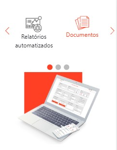

# Web-Pieces
No Desenvolvimento Web estamos constantemente escrevendo sites inteiro, o que garante o uso de um repósitório inteiro de código e portfólio, mas as vezes fazemos apenas algumas seções de um projeto, Seções essas que nos orgulhamos, mas que as vezes não fazemos um repo para cada.

Então neste repositório faço um compilado de algumas seções que me orgulho construídas como parte de um todo. As vezes o projeto tem algumas modificações necessárias quando em deploy.

Neste Leia-me pretendo colocar na ordem das pastas (alfabética) para melhor acompanhamento, note que há a data de cada projeto e eles podem não estar online no momento em que vc lê

### compile sass
<code>
sass --watch /assets/style.scss:/assets/style.css
</code>

## Carrossel
>23/07/2020

Carrossel feito para o site da BimWorks, recebo os dados pela api do wordpress do site, e crio a interface pelo javascript.

Está disponível em: [Página BimWorks](https://bimworks.com.br/quem-somos/)

Para justificar o termo "carrossel" note que implemento um modo infinito porque como o cliente disse "a roda tem que girar" então ao chegar ao final de cada volta, duplico o conteúdo, a mesma coisa acontece ao chegar ao início do carrossel

Desktop

Mobile

## Lateral Options
>22/06/2020

Para a empresa de software para obras Stant foi desenhado uma seção de opções, cada opção com uma imagem e conteúdo correspondente, no desktop essas opções são dispostas a esquerda e direita com o conteúdo sendo renderizado ao meio.

Está disponível em: [Homologação DNA for Marketing](https://dnaformarketing.com.br/stant/)

A medida que o texto muda muda tambem o link do botão acima levando para uma página onde possui esses mesmos dados com [mais detalhes](#menu-and-submenu).

Desktop

Mobile

## Menu and Alternate Content
>10/07/2020

Para a empresa de software para obras Stant na [seção de opções laterais](#lateral-options) cada opção com sua imagem e conteúdo correspondente precisavam de uma página com todos os detalhes sendo exibidos.

Está disponível em: [Homologação DNA for Marketing](https://dnaformarketing.com.br/stant/funcionalidades/)

Não apenas isso como todas as funcionalidades estão na mesma página é necessário que de acordo com o hash esse conteúdo seja modificado

Desktop

Mobile

## Menu and Submenu
>10/07/2020

Para a empresa de software para obras Stant foi desenhado uma seção de opções, antes de expor o conteúdo de forma alternada [neste componente](#menu-and-alternate-content) cada opção tinha um submenu para assim exibir seu conteúdo.

Disponível em: Não está mais disponível :(

Desktop

Mobile

## Watch Countdown
>22/06/2020

Para Dna de vendas foi construído um relógio regressivo para o curso de vendas.

Está disponível em:
- [Inside Sales](https://insidesalesacademy.com.br/hotsite-imob-corretor/)
- [Inside Sales](https://insidesalesacademy.com.br/hotsite-imob-gestor/)

Além de poder mudar de cor quando concluído, podem ser usados vários em uma página, e o tempo "linha de chegada também é setado no js

<code>
let finishDate = new Date('2020-04-29T09:00:00') // ano, dia, mes, hora, minuto, segundo
div = document.querySelector('.watch')
countdown = new Countdown(div, finishDate)
</code>

ScreenShot

